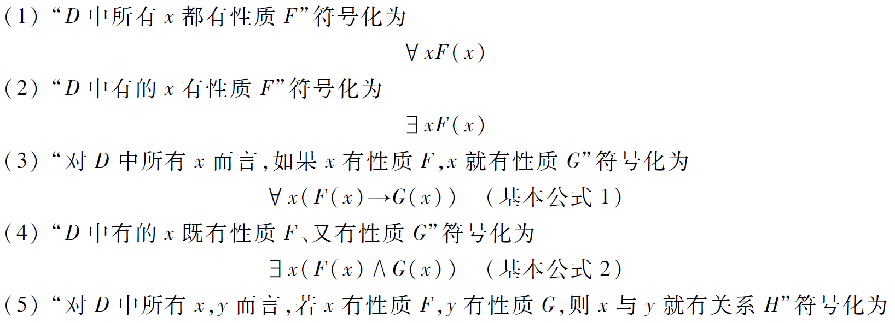
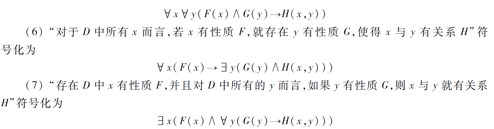
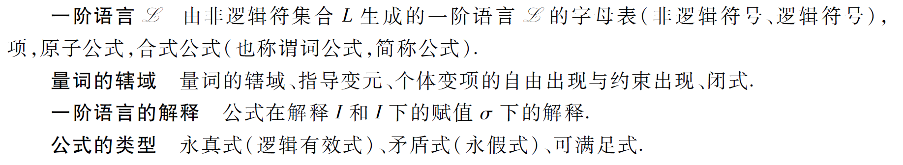

# 一阶逻辑基本概念

## 一阶逻辑命题符号化

### 个体词

**个体词**是研究对象中可以独立存在的客体（可具体可抽象）。
**个体常项**——具体或特定个体词（a,b,c）
**个体变项**——抽象或泛指的个体词（x,y,z），取值范围叫**个体域**（有限、无限）。
特殊的个体域：**全总个体域**，由宇宙间全部事物组成，不指明就取这个。

### 谓词

**谓词**刻画个体词性质和个体词间相互关系（F、G、H）。
**谓词常项/变项**
含有n个个体变项的谓词叫**n元谓词**，记作$P(x_1,x_2,\cdots,x_n)$，是以个体域为定义域，以{0，1}为值域的n元函数（关系）。
**0元谓词**

### 量词

**量词**表示个体常项或变项间的数量关系，有两种：

- 全称量词 $\forall$
  >个体域里的所有个体，个体域已给定
  >可表示为“一切的”“所有的”“每一个”“任意”等
- 存在量词 $\exist$
  >个体域内有一个个体
  >可表示为“存在”“有一个”“有的”等

### 命题符号化

## 一阶逻辑公式及解释

