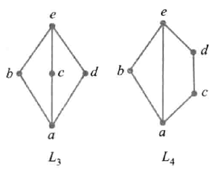

# 格与布尔代数

注意：**本章的$\land,\lor$不代表合取、析取，是格中的运算符**

## 格

### 定义

- 偏序集定义：设$<S,\preccurlyeq>$是偏序集，若$\forall x,y\in S,\set{x,y}$都有最小上界和最大下界，那么$S$关于$\preccurlyeq$构成格。
- 代数系统定义：设$<S,*,\circ>$是具有两个二元运算的代数系统，且对于$*$与$\circ$满足交换律、结合律、吸收律，适当定义偏序$\preccurlyeq$让$<S,\preccurlyeq>$构成一个格（$\forall a,b\in S$有$a\land b=a*b,a\land b=a\circ b$）。

实例：集合的幂集格（$<P(B),\subseteq>$），群的子群格（$<L(G),\subseteq>,L(G)=\set{H|H\leqslant G}$），正整数的正因子格（$<G,D>,G$为一个正整数$n$的所有正因子，$D$是整除关系）

### 性质

#### 对偶原理

若$f$是含有格中元素、$=、\preccurlyeq、\succcurlyeq、\land、\lor$的命题，$f^*$就是将$f$中$\succcurlyeq$替换为$\preccurlyeq$，$\preccurlyeq$替换为$\succcurlyeq$，$\land$替换为$\lor$，$\lor$替换为$\land$的命题，叫做$f$的**对偶命题**。若$f$对一切格为真，$f^*$对所有格也为真。

#### 运算性质

$<L,\preccurlyeq>$是格，满足：

- 交换律：$\forall a,b\in L,\\a\land b=b\land a\\a\lor b=b\lor a$
- 结合律：$\forall a,b,c\in L,\\(a\land b)\land c=a\land(b\land c)\\(a\lor b)\lor c=a\lor(b\lor c)$
- 幂等律：$\forall a\in L,\\a\land a=a\lor a=a$
- 吸收律：$\forall a,b\in L,\\a\lor(a\land b)=a\land(a\lor b)=a$

#### 偏序与运算的关系

$L$是格，$\forall a,b\in L$满足：$$a\preccurlyeq b\Leftrightarrow a\land b=a\Leftrightarrow a\lor b=b$$

#### 保序原理

$L$是格，$\forall a,b,c,d\in L$，若$a\preccurlyeq b$且$c\preccurlyeq d$，那么$$a\land c\preccurlyeq a\preccurlyeq b\\a\land c\preccurlyeq c\preccurlyeq d$$

### 子格

$L$是格，$S$是$L$的非空子集，若$S$关于$L$的运算仍构成格，那么$S$是$L$的子格。

判定方法是：

- $S$非空
- $S$关于$L$中的两个运算封闭

## 分配格、有界格、有补格、布尔代数

### 分配格

$<L,\land,\lor>$是格，若$\forall a,b,c\in L$，有
$$a\land(b\lor c)=(a\land b)\lor(a\land c)\\a\lor(b\land c)=(a\lor b)\land(a\lor c)$$
则$L$是分配格。（用定义证的时候只需要满足其中一个即可）

其他的判别方法：

- 格$L$是分配格$\Leftrightarrow L$不含任何与钻石格与五角格同构的子格。

图中$L_3,L_4$为钻石格、五角格（$L_4$中间$a-e$不影响）

- 格$L$是分配格$\Leftrightarrow \forall a,b,c\in L(a\land b=a\land c$且$a\lor b=a\lor c\Rarr b=c$)

### 有界格

$L$是格，
若存在$0\in L$使得$\forall x\in L$有$0\preccurlyeq x$，$0$是$L$的**全下界**；
若存在$1\in L$使得$\forall x\in L$有$x\preccurlyeq 1$，$1$是$L$的**全上界**。

若$L$既有全下界又有全上界，$L$是有界格，记作$<L,\land,\lor,0,1>$。

### 有补格

有界格$L$中，$a\in L$，若存在$b\in L$使得$a\land b=0,a\lor b=1$，$b$是$a$的补元。
有界格$L$中，$\forall a\in L$，$L$中都有$a$的补元存在，则$L$是有补格。

有界分配格$L$中的元素$a$存在补元，则是唯一的。

### 布尔代数

#### 定义

1. 有补分配格。
2. $<B,*,\circ>$是代数系统，$B$是布尔代数需$*,\circ$满足：
   - 交换律
   - 分配律
   - 同一律：$\exist0,1\in B$，使得$\forall a\in B$有$$a*1=a,a\circ0=a$$
   - 补元律：$\forall a\in B$，$\exist a'\in B$使得$$a*a'=0,a\circ a'=1$$

#### 性质

- 双重否定律：$\forall a\in B, (a')'=a$
- 德摩根律：$\forall a,b\in B, (a\land b)'=a'\lor b',(a\lor b)'=a'\land b'$

其特例就是命题代数、集合代数中的双重否定律、德摩根律。

#### 有限布尔代数的结构

$L$是格，$0\in L,1\in L$，若$\forall b\in L$有$$0\prec b\preccurlyeq a$$
那么$a$是$L$中的**原子**。

有**表示定理**：
设$B$是有限布尔代数，$A$是$B$的全体原子构成的集合，$B$同构于$A$的幂集代数$P(A)$。

**推论**：

- 任何有限布尔代数的基数为$2^n,n\in \N$
- 任何等势的布尔代数均是同构的
